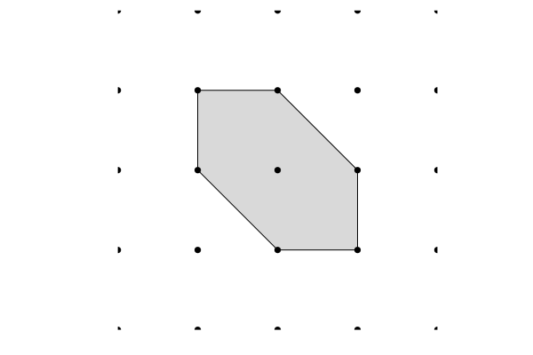

# RationalPolygons.jl

[RationalPolygons.jl](https://github.com/justus-springer/RationalPolygons.jl)
is a pure Julia package for computations with rational convex polygons. It implements

- [counting lattice points](polygons.md#Counting-lattice-points),
  [Ehrhart Theory](polygons.md#Ehrhart-Theory),
  [normal forms](polygons.md#Normal-forms),
  [automorphism groups](polygons.md#Automorphism-groups),
  [computation of subpolygons](subpolygons.md),
- various [classification algorithms](classifications.md) for integral and rational polygons.

I have written RationalPolygons.jl in the span of about six months while
working on a joint project with Martin Bohnert [BS24](@cite). Its main purpose
is to provide reference implementations of the classification algorithms
developed in our paper. However, it also implements many more basic algorithms
for computations with rational polygons that I believe might be useful in other
projects, hence I have documented them here. RationalPolygons.jl does not make
use of any external computer algebra system but implements all necessary
algorithms, including two-dimensional euclidian geometry, from scratch in pure
Julia. This allows for quite good performance, with computations involving
billions of polygons being feasable on a personal computer.

# Quick start

```@repl quick_start
using RationalPolygons
P = convex_hull(LatticePoint{Int}[(1,0),(0,1),(-1,1),(-1,0),(0,-1),(1,-1)])
plot_polygon(P)
```



```@repl quick_start
number_of_interior_lattice_points(P)
number_of_boundary_lattice_points(P)
euclidian_area(P)
ehrhart_quasipolynomial(P)
affine_automorphism_group(P)
is_fano(P)
dual(P)
are_affine_equivalent(P, dual(P))
gorenstein_index(P)
```

```@bibliography
```


