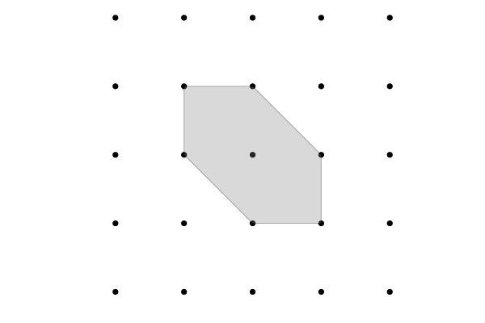

# RationalPolygons.jl

[RationalPolygons.jl](https://github.com/justus-springer/RationalPolygons.jl) is
a pure Julia package for computations with rational polygons. A _rational
polygon_ is a convex two-dimensional polytope with vertices in ``\mathbb{Q}``.
It implements [counting lattice points](polygons.md#Counting-lattice-points),
[Ehrhart Theory](polygons.md#Ehrhart-Theory), [normal
forms](polygons.md#Normal-forms), [automorphism
groups](polygons.md#Automorphism-groups), [computation of
subpolygons](subpolygons.md) as well as various [classification
algorithms](classifications.md).

`RationalPolygons.jl` does not make use of any external computer algebra system
but implements all necessary algorithms, including two-dimensional euclidean
geometry, from scratch in pure Julia. This allows for quite good performance,
with computations involving billions of polygons being feasible on a personal
computer.

## Quick start

```@repl quick_start
using RationalPolygons, Plots
P = convex_hull(LatticePoint{Int}[(1,0),(0,1),(-1,1),(-1,0),(0,-1),(1,-1)])
plot(P)
```



```@repl quick_start
number_of_interior_lattice_points(P)
number_of_boundary_lattice_points(P)
euclidean_area(P)
ehrhart_quasipolynomial(P)
affine_automorphism_group(P)
is_ldp(P)
dual(P)
are_affine_equivalent(P, dual(P))
gorenstein_index(P)
```
